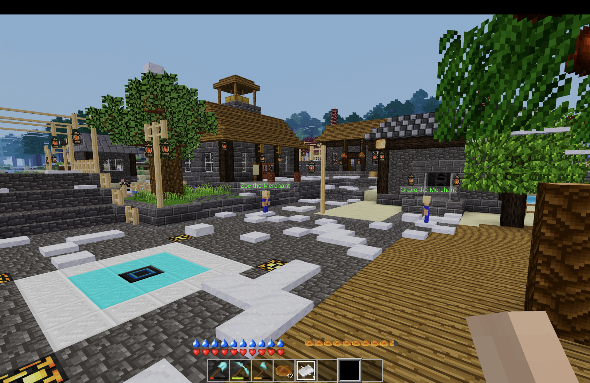

# Evergrowth

Evergrowth is an open-ended sandbox game for Minetest (Luanti) built on the foundation of Minetest Game. Set across diverse biomes and deep caverns, it places no limits on your ambition. Players can wander ancient ruins and fight hostile plunderers, collect and cultivate a wide variety of crops, establish towns and trade with hired NPC specialists, craft magical items of great power, build resource extraction and automation networks, or bypass the terrain entirely using ground, maritime, and aerial vehicles.

## Core Features
- **Dynamic Settlements (`eg_settlers`)**: NPC and economy system that allows players to "hire" and trade with specialized settlers (such as guards, farmers, and blacksmiths), with future plans for community management structures, daily schedules, and more.
- **Industry & Automation**: Technology infrastructure powered by the `techage` ecosystem, supporting automation, fluid dynamics, power generation, and advanced processing networks.
- **Transportation**: Dynamic vehicle physics utilizing `airutils` (and its descendents), `automobiles_pck`, and `motorboat` libraries, bringing ground, maritime, and aerial transport. This includes cars, ships, fixed-wing aircraft, helicopters, and submarines into active play.
- **World Gen & Biomes**: Multi-faceted exploration spanning custom surface environments via `ethereal` and subterranean layers through `caverealms`.
- **Survival Mechanics**: Hunger and satiation mechanics integrated with HUD bars, armor progression, a dynamic weather and wind system (`climate`), and expanded cooking and farming ecosystems.
- **Combat & Hostile Mobs**: Defensive equipment and weapons from `bweapons_modpack`, item enchantment from `x_enchanting`, hostile NPCs from `raiders`, and natural predators from `mobs_water`.

## Repository Structure

- `mods/` - Integrated mod ecosystem containing community packs and custom-developed mods.
  - `eg_settlers/` - The core settlement generation mod (formerly `evergrowth_villages`), fully merged with historical commits preserved.
  - `eg_third_party_docs/` - Modular encyclopedia and help entries for existing third-party systems.
  - `*_tweaks/` - Core overrides and custom behaviors for community mods (e.g., `aircraft_tweaks`, `automobiles_tweaks`, `mobs_animal_tweaks`, `techage_tweaks`, etc.).
- `menu/` - Main menu assets and configuration.
- `research/` - Prototyping and reference designs for sub-systems.
- `utils/` - Administrative and maintenance tools (using `venv/` for python dependencies).

## Integrated Community Mods

Evergrowth is built on the foundation of Minetest Game (MTG) and utilizes a carefully curated selection of 80 integrated community mods to provide its rich features (such as vehicle systems, machinery, biomes, and magic) without rebuilding those complex engines from scratch. This is not just mod soup! 
These mods are pre-packaged directly in the `mods/` directory for three critical reasons:
1. **Out-of-the-Box Playability**: Players and server hosts do not need to hunt down, download, or configure 80 separate external mods. The game is fully complete and playable immediately upon installation.
2. **Stability & Version Control**: Community mods evolve independently and updates can frequently introduce breaking conflicts. Statically snapshotting these specific versions guarantees that all integrated systems remain locked at tested, compatible, and stable states.
3. **Custom Integration & Optimization**: Many of these mods have been custom-tweaked to ensure thematic compatibility and clean performance. Unnecessary heavy dependencies have been removed, and key components have been isolated (for example, the hostile `raiders` were cleanly stripped out of a much larger community mod to keep the codebase focused and lightweight).

The complete list of these integrated community dependencies is documented in [external_mods.md](external_mods.md).

## Installation & Setup

1. Clone or copy the `evergrowth` directory to your Minetest `games/` folder:
   - **macOS**: `/Users/<user>/Library/Application Support/minetest/games/evergrowth`
   - **Linux**: `~/.minetest/games/evergrowth`
   - **Windows**: `<minetest_install_directory>\games\evergrowth`
2. Launch Minetest (v5.8+ recommended).
3. Create a new world, selecting **Evergrowth** as the target game.
